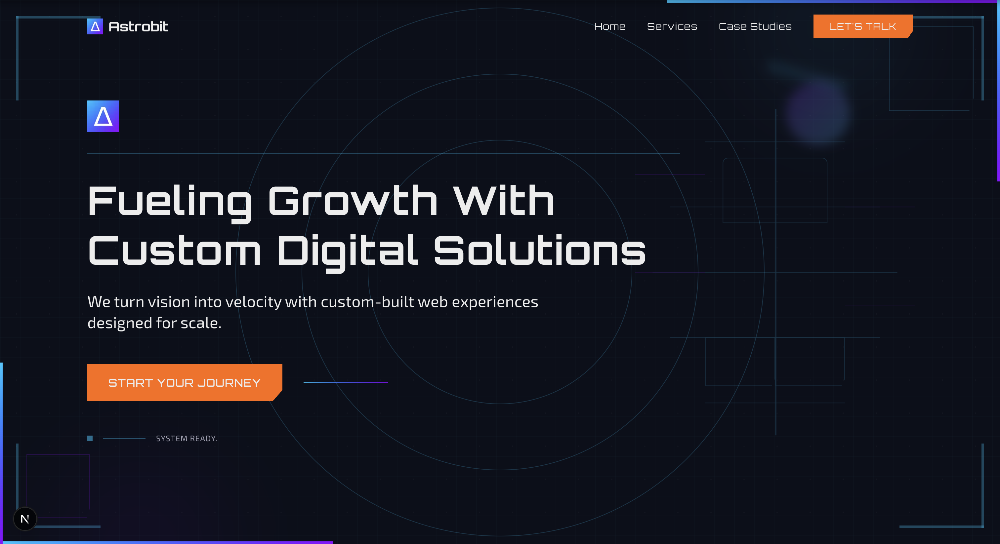
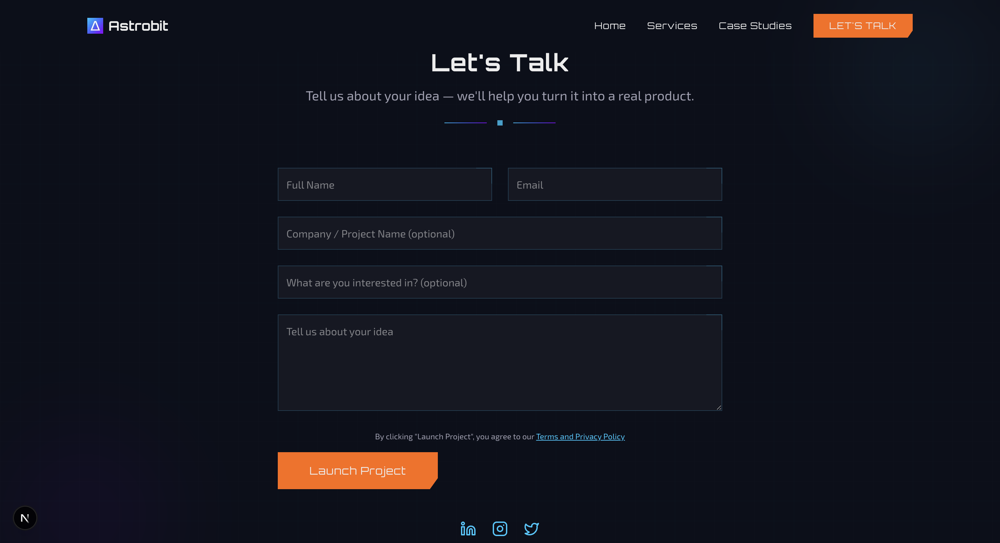

# Astrobit - Professional Digital Solutions Agency

> Transform your business with custom web applications, high-converting landing pages, and intelligent chatbots. Expert development team delivering modern digital solutions.

**🌐 Live Website:** [goastrobit.com](https://www.goastrobit.com/)



## 🚀 Overview

Astrobit is a modern, high-performance website built for a digital solutions agency specializing in custom web applications, landing pages, and chatbots. The platform showcases the company's services, case studies, and provides seamless client engagement through an integrated contact system.

### Key Features

- **🎨 Modern Design**: Clean, professional interface with smooth animations
- **📱 Responsive**: Mobile-first design optimized for all devices
- **⚡ Performance**: Built with Next.js 15 and optimized for speed
- **🎯 SEO Optimized**: Comprehensive SEO with structured data and metadata
- **📧 Contact System**: Robust form handling with email notifications
- **📊 Analytics**: Integrated Vercel Analytics for insights
- **🗃️ Database**: MongoDB integration for data persistence

## 🛠️ Tech Stack

### Frontend

- **Framework**: Next.js 15 (App Router)
- **Language**: TypeScript
- **Styling**: Tailwind CSS 4
- **Animations**: Motion v12
- **Fonts**: Orbitron & Exo 2 (Google Fonts)
- **Icons**: Lucide React

### Backend & Integrations

- **Database**: MongoDB
- **Email Service**: Resend
- **Analytics**: Vercel Analytics
- **Deployment**: Vercel

### Development Tools

- **Linting**: ESLint with Next.js config
- **Formatting**: Prettier with Tailwind plugin
- **Package Manager**: npm

## 📋 Prerequisites

- Node.js 18+
- npm or yarn
- MongoDB database
- Resend account for email services

## ⚙️ Environment Setup

Create a `.env.local` file in the root directory:

```env
# Database
MONGODB_URI=your_mongodb_connection_string

# Email Service
RESEND_API_KEY=your_resend_api_key
CONTACT_EMAIL=your_contact_email@domain.com

# Optional: For development
NODE_ENV=development
```

## 🚀 Getting Started

1. **Clone the repository**

    ```bash
    git clone https://github.com/Ilchampo/astrobit-website.git
    cd astrobit-website
    ```

2. **Install dependencies**

    ```bash
    npm install
    ```

3. **Set up environment variables**

    ```bash
    cp .env.example .env.local
    # Edit .env.local with your configuration
    ```

4. **Run the development server**

    ```bash
    npm run dev
    ```

5. **Open your browser**
   Navigate to [http://localhost:3000](http://localhost:3000)

## 📝 Available Scripts

```bash
# Development with Turbopack
npm run dev

# Production build
npm run build

# Start production server
npm start

# Linting
npm run lint

# Code formatting
npm run format
```

## 🏗️ Project Structure

```
src/
├── app/                    # Next.js App Router
│   ├── layout.tsx         # Root layout with SEO & analytics
│   ├── page.tsx           # Homepage
│   ├── api/               # API routes
│   │   └── contact/       # Contact form endpoint
│   ├── services/          # Services pages
│   └── case-studies/      # Case studies pages
├── components/            # React components
│   ├── common/           # Shared components
│   ├── LandingHero/      # Hero section
│   ├── Services/         # Services showcase
│   ├── CaseStudies/      # Case studies display
│   └── Differentiators/  # Company differentiators
├── lib/                  # Utilities & constants
│   ├── constants/        # Static data
│   ├── interfaces/       # TypeScript types
│   └── utils/            # Helper functions
└── server/               # Backend logic
    ├── database/         # MongoDB connection
    └── services/         # Business logic
```

## 🎨 Design System

### Colors

- **Primary**: Dark theme with blue accents
- **Background**: `#0B0F1A` (Dark navy)
- **Typography**: Orbitron (headings), Exo 2 (body)

### Animations

- **Hero Entrance**: Staggered fade-up animations
- **Scroll Triggers**: Elements animate on scroll
- **Hover Effects**: Subtle scale and translation effects
- **Loading States**: Smooth transitions between states

### Components

- **Modular Design**: Reusable component architecture
- **Responsive**: Mobile-first approach
- **Accessible**: WCAG compliant design patterns

## 📧 Contact Form System



### Features

- **Validation**: Client and server-side validation
- **Duplicate Prevention**: 24-hour submission cooldown
- **Email Notifications**: Automatic email via Resend
- **Database Storage**: Contact submissions stored in MongoDB
- **Error Handling**: Comprehensive error management
- **Rate Limiting**: Built-in spam protection

### API Endpoint

```
POST /api/contact
```

**Request Body:**

```json
{
	"name": "string",
	"email": "string",
	"company": "string",
	"interest": "string",
	"message": "string"
}
```

## 🔒 Security Features

- **Input Validation**: Server-side validation for all inputs
- **Rate Limiting**: Protection against spam submissions
- **Environment Variables**: Sensitive data stored securely
- **HTTPS**: SSL/TLS encryption for all communications
- **Data Sanitization**: Clean data before database storage

## 📊 SEO & Performance

### SEO Features

- **Structured Data**: JSON-LD for better search visibility
- **Meta Tags**: Comprehensive Open Graph and Twitter cards
- **Sitemap**: Auto-generated XML sitemap
- **Robots.txt**: Search engine crawling instructions
- **Canonical URLs**: Proper URL canonicalization

### Performance Optimizations

- **Next.js 15**: Latest framework optimizations
- **Image Optimization**: Automatic image compression
- **Font Loading**: Optimized Google Fonts loading
- **Code Splitting**: Automatic bundle optimization
- **Caching**: Proper browser and CDN caching

## 🚀 Deployment

The application is deployed on Vercel with automatic deployments from the main branch.

### Environment Variables (Production)

Ensure the following environment variables are set in your deployment platform:

- `MONGODB_URI`
- `RESEND_API_KEY`
- `CONTACT_EMAIL`

---

**Built with ❤️ by the Astrobit Team**
